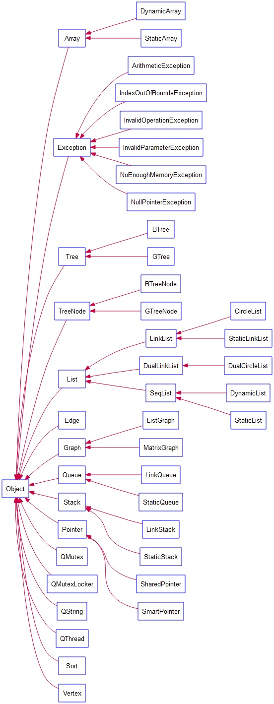

## 1.QLib库概述

使用c++模板技术实现的一个“数据结构”库，实现了链表、栈、队列、树、图等。

## 2.QLib库包含的内容

- 顶层父类-保证单一继承树和规范动态内存申请行为
- 异常类族-使用异常处理机制分离正常逻辑和异常逻辑
- 智能指针类-用于规避多重释放和内存泄漏的Bug
- 静态顺序表、动态顺序表的实现、仿STL的顺序表迭代器实现、数组类的设计与实现
- 单链表、静态单链表、双向链表、循环链表、基于Linux内核链表的双向循环链表类的实现
- 顺序栈、链式栈、顺序队列、链式队列的实现
- 创建字符串类族、重载实现其比较、加法、赋值、插入、判断、去空等操作
- 排序类的实现，选择排序、插入排序、冒泡排序，希尔排序归并排序、快速排序等排序算法的实现
- 通用树类的实现，实现了树的查找、插入、清除、删除、结点数/高度/度的获取、树的层次遍历等操作
- 二叉树类的实现，实现了树的查找.插入.清除、删除、结点数/高度/度的获取、树的层次遍历和典型遍历、克隆、比较、相加、线索化等操作
- 图的邻接矩阵和邻接链表存储实现，图的深度优先/广度优先遍历、最小生成树、最短路径算法的实现
- 基于RAII机制的QMutex和QMutexLocker、仿Qt的线程类QThread

## 3.详细的说明文档

QLib中各个类的继承关系如下图：



在[docs](./docs)目录下存放了每个类的设计说明文档：

- [01.顶层父类Object的创建](./docs/01_顶层父类Object/01.顶层父类Object的创建.md)
- [02.异常类的设计与实现](./docs/02_异常类的设计与实现/02.异常类的设计与实现.md)
- [03-1.智能指针的设计与实现1-SmartPointer](./docs/03_智能指针的设计与实现/03.智能指针的设计与实现1-SmartPointer.md)
- [03-2.智能指针的设计与实现2-SharedPointer](./docs/03_智能指针的设计与实现/03.智能指针的设计与实现2-SharedPointer.md)
- [04-1.线性表的抽象实现](./docs/04_顺序表/04-1.线性表的抽象实现.md)
- [04-2.顺序表的抽象实现](./docs/04_顺序表/04_2顺序表的抽象实现/04-2.顺序表的抽象实现.md)
- [04-3.静态顺序表和动态顺序表的实现](./docs/04_顺序表/04_3静态顺序表和动态顺序表/04-3.静态顺序表和动态顺序表.md)
- [05.数组类的设计与实现](./docs/05_数组类的设计与实现/05.数组类的设计与实现.md)
- [06-1.单链表的设计与实现](./docs/06_链表/06_1单链表的设计与实现/06-1.单链表的设计与实现.md)
- [06-2.线性表find函数的添加](./docs/06_链表/06_2线性表find函数的添加/06-2.线性表find函数的添加.md)
- [07-1.顺序栈的设计与实现](./docs/07_栈/07_1顺序栈的设计与实现/07-1.顺序栈的设计与实现.md)
- [07-2.链式栈的设计与实现](./docs/07_栈/07_2链式栈的设计与实现/07-2.链式栈的设计与实现.md)
- [08-1.顺序队列的设计与实现](./docs/08_队列/08_1顺序队列的设计与实现/08-1.顺序队列的设计与实现.md)
- [08-2.链式队列的设计与实现](./docs/08_队列/08_2链式队列的设计与实现/08-2.链式队列的设计与实现.md)
- [基于RAII机制的QMutex和QMutexLocker设计与实现](./docs/QMutex和QMutexLocker设计与实现/基于RAII机制的QMutex和QMutexLocker设计与实现.md)
- [仿Qt的线程类QThread设计与实现](./docs/QThread线程类的设计与实现/QThread线程类的设计与实现.md)

## 4.单元测试

QLib使用第三方库googletest进行了各个类的单元测试：

- [顶层父类Object单元测试](./test/testObject.h)
- [异常类族单元测试](./test/testException.h)
- [智能指针-SmartPointer单元测试](./test/testSmartPointer.h)
- [智能指针-SharedPointer单元测试](./test/testSharedPointer.h)
- [顺序表-StaticList单元测试](./test/testStaticList.h)
- [顺序表-DynamicList单元测试](./test/testDynamicList.h)
- [数组类-StaticArray单元测试](./test/testStaticArray.h)
- [数组类-DynamicArray单元测试](./test/testDynamicArray.h)
- [链表-单链表LinkList单元测试](./test/testLinkList.h)
- [链表-循环单链表CircleList单元测试](./test/testCircleList.h)
- [链表-双向链表DualLinkList单元测试](./test/testDualLinkList.h)
- [链表-linux内核链表单元测试](./test/testLinuxList.h)
- [栈-顺序栈StaticStack单元测试](./test/testStaticStack.h)
- [栈-链式栈LinkStack单元测试](./test/testLinkStack.h)
- [队列-顺序队列StaticQueue单元测试](./test/testStaticQueue.h)
- [队列-链式队列LinkQueue单元测试](./test/testLinkQueue.h)
- [排序类-Sort单元测试](./test/testSort.h)
- [图-邻接矩阵图MatrixGraph单元测试](./test/testMatrixGraph.h)
- [图-邻接链表图ListGraph单元测试](./test/testListGraph.h)
- [线程类QThread单元测试](./test/testQThread.h)

## 5.编译单元测试

### 5.1编译第三方库和所有单元测试

在QLib目录下执执行下面的编译命令，将编译第三方库和所有单元测试

```shell
make
```

### 5.2执行单元测试

```shell
make runTest
```

### 5.3生成单元测试通过率报告和代码覆盖率报告（html格式）

```shell
make report
```
