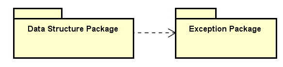

## 1.异常的注意点

- 异常的类型可以是**自定义类类型**

- 对于类类型的匹配依旧是**自上而下严格匹配**

- **赋值兼容性原则**在异常匹配中依然适用

    > 一般而言：
    >
    > **匹配子类异常的catch放在上部**
    >
    > **匹配父类异常的catch放下部**

## 2.异常类的设计

### 2.1现代c++库中的异常类

- 现代C++库必然包含充要的异常类族
- 异常类是数据结构类所依赖的基础设施

例如在C++ 标准库中提供了一系列标准的异常，定义在 **<exception>** 中，我们可以在程序中使用这些标准的异常。

它们是以父子类层次结构组织起来的，如下所示：


下表是对上面层次结构中出现的每个异常的说明：

| 异常                   | 描述                                                         |
| :--------------------- | :----------------------------------------------------------- |
| **std::exception**     | 该异常是所有标准 C++ 异常的父类。                            |
| std::bad_alloc         | 该异常可以通过 **new** 抛出。                                |
| std::bad_cast          | 该异常可以通过 **dynamic_cast** 抛出。                       |
| std::bad_exception     | 这在处理 C++ 程序中无法预期的异常时非常有用。                |
| std::bad_typeid        | 该异常可以通过 **typeid** 抛出。                             |
| **std::logic_error**   | 理论上可以通过读取代码来检测到的异常。                       |
| std::domain_error      | 当使用了一个无效的数学域时，会抛出该异常。                   |
| std::invalid_argument  | 当使用了无效的参数时，会抛出该异常。                         |
| std::length_error      | 当创建了太长的 std::string 时，会抛出该异常。                |
| std::out_of_range      | 该异常可以通过方法抛出，例如 std::vector 和 std::bitset<>::operator[]()。 |
| **std::runtime_error** | 理论上不可以通过读取代码来检测到的异常。                     |
| std::overflow_error    | 当发生数学上溢时，会抛出该异常。                             |
| std::range_error       | 当尝试存储超出范围的值时，会抛出该异常。                     |
| std::underflow_error   | 当发生数学下溢时，会抛出该异常。                             |

可以通过继承和重载 **exception** 类来定义新的异常。下面的实例演示了如何使用 std::exception 类来实现自己的异常：

```c++
#include <iostream>
#include <exception>
using namespace std;

struct MyException : public exception
{
    const char * what () const throw ()
    {
        return "C++ Exception";
    }
};

int main()
{
    try
    {
        hrow MyException();
    }
    catch(MyException& e)
    {
        std::cout << "MyException caught" << std::endl;
        std::cout << e.what() << std::endl;
    }
    catch(std::exception& e)
    {
        //其他的错误
    }
}
```

### 2.2当前库中异常类的设计

当前是实现一个数据结构库，针对可能发生的异常，可以设计这样的异常类族：

- Exception作为异常的顶层父类，它是一个抽象类，不能用来定义对象，用来被继承
- 定义以下几种异常：


| 异常类                    | 功能定义       |
| ------------------------- | -------------- |
| ArithmeticException       | 计算异常       |
| NullPointerException      | 空指针异常     |
| IndexOutOfBoundsException | 越界异常       |
| NoEnoughMemoryException   | 内存不足异常   |
| InvalidParameterException | 参数错误异常   |
| InvalidOperationException | 无效的操作异常 |

## 3.异常类中的接口定义

Exception父类的接口定义

```c++
class Exception
{
public:
    Exception(const char * message);
    Exception(const char * file, int line);
    Exception(const char * message, const char * file, int line);

    Exception(const Exception& e);
    Exception & operator = (const Exception & e);

    virtual const char * message() const;/* 用于获取异常的说明信息 */
    virtual const char * location() const;/* 用于定位异常出现的位置 */

    virtual ~Exception() = 0;
};
```

## 4.异常类实现

### 4.1实现代码

[Exception.h](../../QLib/Exception.h)

[Exception.cpp](../../QLib/Exception.cpp)

#### 4.2析构函数实现说明

```c++
 virtual ~Exception() = 0;
```

这里析构函数是一个纯虚的析构函数，一般纯虚函数不需要提供实现，由子类来完成。析构函数是一个例外，但凡自定义了析构函数，不管它是否是纯虚函数，一定要提供实现。

为什么有这个规定哪？因为在析构一个对象的时候，最后肯定会调用到父类的析构函数，如果父类的析构函数是一个纯虚函数并且没有具体的实现，那一连串的析构工作如何完成哪？

### 4.3设计原则

在可复用代码库设计时，**尽量使用面向对象技术**进行架构，**尽量使用异常处理机制**分离正常逻辑和异常逻辑。

## 5.总结

- 现代c++库必然包含**充要的**异常类族
- 所有库中的数据结构类**都依赖于**异常机制
- 异常机制能够分离库中代码的**正常逻辑**和**异常逻辑**

