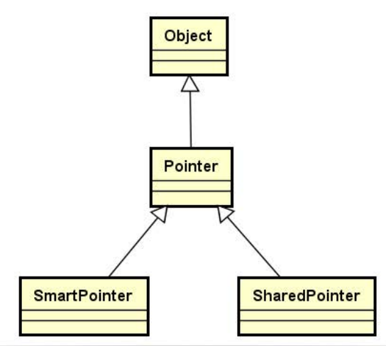

## 1.为什么需要智能指针呢？

**内存泄漏问题（臭名昭著的bug）：**

> 因为c++语言中没有垃圾回收机制，指针无法控制所指向堆空间的生命周期，如果动态申请堆空间，用完后不归还，就会造成内存泄漏。  

## **2.当代c++软件平台的智能指针的特性**

- 指针生命周期结束时**主动释放堆空间**
- **一片堆空间最多只能由一个指针标识**
- 杜绝指针运算和指针比较

## 3.智能指针的初步实现

### 3.1实现要点

**通过类模板描述指针的行为**

- 能够定义**不同类型**的指针对象


**重载指针特征操作符（`->`和`*`）**

- **利用对象模拟原生指针的行为**，对象在生命周期结束时会调用析构函数，那么我们可以在析构函数中主动释放堆空间了

### 3.2 智能指针实现思路

**编写指针模板类的思路：**

1. **定义构造函数和析构函数**

    构造函数传入指针，析构函数delete指针

2. **重写拷贝构造函数，重载赋值操作符**

    实现这两个函数是为了：一片堆空间最多只能由一个指针标识

3. **重载 `* ->`**

    重载这两个操作符是为了：利用对象模拟原生指针的行为

4. **其他** 

    判空函数：判断指针是否为空

    获取指针函数：获取指针

### 3.3 编程实现智能指针

```c++
#ifndef SMARTPOINTER_H_
#define SMARTPOINTER_H_
#include <cstdlib>
#include <iostream>
using namespace std;
namespace QLib
{

template <typename T>
class SmartPointer
{
    T* m_pointer;
public:
    SmartPointer(T* p = NULL)
    {
        m_pointer = p;
    }
    ~SmartPointer()
    {
        delete m_pointer;
    }
    SmartPointer(const SmartPointer<T>& obj)
    {
        m_pointer = obj.m_pointer;
        const_cast<SmartPointer<T>& >(obj).m_pointer=NULL;
    } 
    SmartPointer<T>& operator =(SmartPointer<T>& obj)
    {
        if(&obj != this)
        {
            delete m_pointer;
            m_pointer = obj.m_pointer;
            const_cast<SmartPointer<T>& >(obj).m_pointer=NULL;
        }
        return *this;
    }
    T& operator *()
    {
        return *m_pointer;
    }
    T* operator ->()
    {
        return m_pointer;
    }
    bool isNULL()
    {
        return m_pointer == NULL;
    }
    T* get()
    {
        return m_pointer;
    }
};

}
#endif
```

**编写使用测试：**

```c++
#include <iostream>
#include "SmartPointer.h"
using namespace std;
using namespace QLib;
class Test
{
public:
    Test()
    {
        cout<<"Test()"<<endl;
    }
    ~Test()
    {
        cout<<"~Test()"<<endl;
    }
};
int main(int argc, const char *argv[])
{
    SmartPointer<Test>sp = new Test();
    SmartPointer<Test>nsp;
    nsp=sp;                   /* 测试赋值操作符 */
    //nsp++;                  /* 测试指针运算 */
    cout<<sp.isNULL()<<endl;  /* 测试一片堆空间最多只能由一个指针标识 */
    cout<<nsp.isNULL()<<endl;
    return 0;
}
```

**智能指针的使用注意：**

- 只能用来指向堆空间中的单个对象或者变量
- 不能用来指向一个数组，也不能用来指向一个栈上的局部变量

### 3.4当前智能指针实现的问题

**SmartPointer的设计方案**：

- 指针生命周期结束时主动释放堆空间
- **一片堆空间最多只能由一个指针标识**
- 杜绝指针运算和指针比较

**问题分析:**

`	SmartPointer`的特性是**一片堆空间最多只能由一个指针标识**，需要多个指针指向同一个数据元素时会出现程序异常。

## 4.新的智能指针

- 实现两种不同的智能指针，`SmartPointer`和`SharedPointer`。
- 其中`SharedPointer`支持多个智能指针指向同一个数据元素。
- 给两种智能指针创建一抽象的指针父类。



### 4.1抽象指针父类的实现

`Pointer`是智能指针的抽象父类（模板）,重点实现以下几点：

- 重载 `operator->()`
- 重载`operator *()`

- 析构函数必须是纯虚函数`virtual~Pointer() = 0;`因为Pointer是抽象父类

>由于Pointer类继承自顶层父类，**Object的析构函数已经是纯虚函数**了，没有必要声明Pointer的析构函数是纯虚函数，**只要Pointer不实现析构函数**，Pointer类就是一个**抽象类**。

**Pointer类的声明：**

```c++
template<typename T>
class Pointer : public Object
{
protected:
    T* m_pointer;
public:
    Pointer(T* p = NULL);
    T* operator->();
    T* operator->() const;
    T& operator*();
    T& operator*() const;
    bool isNull() const;
    T* get() const;
};
```


### 4.2重构之后的SmartPointer

