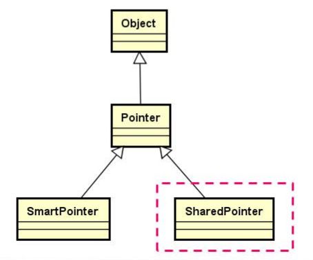

## 1.继承关系图

`SharedPointer`和`SmartPointer`的地位是一样的， 这两个类都是智能指针类。



## 2.SharedPointer设计要点

- 使用类模板实现
- **通过计数机制**（ref）标识堆内存
    - 堆内存被指向时：`ref++`
    - 指针被置空时：`ref--`
    - `ref == 0`时，释放堆空间


​	计数变量也是也是在**堆空间**中创建的，**计数变量的生命周期**和**堆空间中的对象的生命周期**是完全一样的，在逻辑上他们关联在一起。

## 3.SharedPointer类的声明

```c++
template <typename T>
class SharedPointer : public Pointer<T>
{
protected:
    int * m_ref;
    void assign(const SharedPointer<T>& obj);
public:
    SharedPointer(T * p = nullptr);
    SharedPointer(const SharedPointer<T>& obj);
    SharedPointer<T>& operator = (const SharedPointer<T>& obj);
    void clear();
    ~SharedPointer();
};
```

**智能指针的比较**

由于SharedPointer支持多个对象同时指向一片堆空间，因此，**必须支持比较操作**

## 4.SharedPointer实现要点

**构造函数**

判读传入的T型指针是否为空，如果非空则在堆中申请引用计数空间并将引用计数设置为1。

```c++
template <typename T>
SharedPointer<T>::SharedPointer(T * p) : m_ref(nullptr)
{
    if(p)
    {
        this->m_ref =static_cast<int * >(malloc(sizeof(int)));
        if(this->m_ref)
        {
            *(this->m_ref) = 1;
            this->m_pointer = p;
        }
        else
        {
            THROW_EXCEPTION(NoEnoughMemoryException, "No memory to create SharedPointer.");
        }
    }
}
```

**assign函数**

用于拷贝SharedPointer中的成员变量，如果引用计数指针非空，则将引用计数加1。

```c++
template <typename T>
void SharedPointer<T>::assign(const SharedPointer<T>& obj)
{
    this->m_ref = obj.m_ref;
    this->m_pointer = obj.m_pointer;
    if(this->m_ref)
    {
        (*this->m_ref)++;
    }
}
```

**拷贝构造函数**

使用**assign函数**实现（拷贝SharedPointer中的成员变量，如果引用计数指针非空，则将引用计数加1。）

```c++
template <typename T>
SharedPointer<T>::SharedPointer(const SharedPointer<T>& obj) : Pointer<T>(nullptr)
{
    assign(obj);
}
```

**clear函数**

用于清空SharedPointer中的成员变量（T类型的指针和引用计数指针），当引用计数计数指针指向的空间中的值为0时，释放引用计数空间，及T*指针指向的空间。

```c++
template <typename T>
void SharedPointer<T>::clear()
{
    T * toDel = this->m_pointer;
    int * ref = this->m_ref;

    this->m_pointer = nullptr;
    this->m_ref = nullptr;
    if(ref)
    {
        (*ref)--;
        if(*ref == 0)
        {
            free(ref);
            delete toDel;
        }
    }
}
```

**赋值操作符**

```c++
template <typename T>
SharedPointer<T>& SharedPointer<T>::operator = (const SharedPointer<T>& obj)
{
    if(this!= &obj)
    {
        clear();
        assign(obj);
    }
    return *this;
}
```

**析构函数**

```c++
template <typename T>
SharedPointer<T>::~SharedPointer()
{
    clear();
}
```

**智能指针的比较**

使用父类中的get函数获取指向空间的指针，比较指针是否相等

`!=`比较可以使用`==`实现

```c++
template <typename T>
bool operator == (const SharedPointer<T>&l, const SharedPointer<T>& r)
{
    return l.get() == r.get();
}

template <typename T>
bool operator != (const SharedPointer<T>&l, const SharedPointer<T>& r)
{
    return !(l == r);
}

```

## 5.智能指针的使用注意事项

- 智能指针**只能用于指向堆空间**中的内存，只能用来**指向堆空间中的单个变量**（对象）
- **计数机制**确保多个智能指针合法的指向同一片堆空间
- **不同类型**的智能指针对象**不能混合使用**
- 不要使用`delete`释放智能指针指向的堆空间


