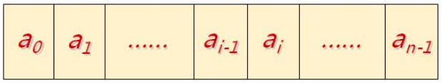
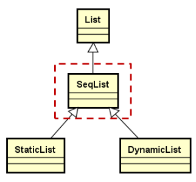

## 1.顺序存储的定义

线性表的顺序存储结构指的是：用一段**地址连续的存储单元**依次存储线性表中的数据元素。




### 1.1 用**一维数组**来实现顺序存储结构

存储空间：`T* m_array`;

顺序表的当前长度：`int m_length`;

```c++
template <typename T>
class SeqList : public List<T>
{
protected:
    T* m_marry;
    int m_length;
    // ......
};
```

## 2.顺序存储关键操作的设计思路

### 2.1 元素**获取**操作

1.  判断目标位置是否合法
2.  如果合法：将目标位置作为数组下标获取元素

```c++
template <typename T>
bool SeqList<T>::get(int i, T & e) const
{
    bool ret = ((0 <= i) && (i < m_length));

    if(ret)
    {
        e = m_array[i];
    }

    return ret;
}
```

### 2.2 元素**插入**操作

1.  判断目标位置是否合法
2.  如果合法：将目标位置（包含目标位置）之后的所有元素后移一个位置
3.  将新元素插入目标位置
4.  线性表长度加1

```c++
template <typename T>
bool SeqList<T>::insert(int i, const T & e)
{
    /* 注意：i<= m_length */
    bool ret = ((0 <= i) && (i <= m_length));
    ret = ret && ((m_length + 1) <= capacity());/* capacity()为数组的存储量 */

    if(ret)
    {
        for(int p = m_length - 1; p >= i; p--)
        {
            m_array[p + 1] = m_array[p];
        }
        m_array[i] = e;
        m_length++;
    }

    return ret;
}
```

### 2.3 顺序存储结构的元素**删除**操作

1.  判断目标位置是否合法

2.  将目标位置后的所有元素前移一个位置

3.  线性表长度减1


```c++
template <typename T>
bool SeqList<T>::remove(int i)
{
    bool ret = ((0 <=i ) && (i < m_length));

    if(ret)
    {
        for(int p = i; p < m_length - 1; p++)
        {
            m_array[p] = m_array[p + 1];
        }
        m_length--;
    }

    return ret;
}
```

## 3.完成**顺序存储结构的线性表**的抽象实现

​	抽象实现是指在SeqList中完成顺序表的关键操作，但还是不能生成具体的对象，因为顺序存储空间的指定 并不在SeqList中完成,SeqList依然是抽象类。存储空间及容量的指定由SeqList的子类StaticList和DynamicLIst完成




### 3.1 SeqList设计要点

- `SeqList`是抽象类模板，**存储空间的位置和大小由子类完成**
- 实现顺序存储结构线性表的**关键操作**（增，删，查等）
- **提供数组操作符**，方便快速获取元素

### 3.2 SeqList的实现分析

```c++
template <typename T>
class SeqList : public List<T>
{
protected:
    T * m_array;/* 顺序存储空间的指针，具体空间分配由子类实现 */
    int m_length;
public:
    bool insert(int i, const T & e) override;
    bool insert(const T & e) override;
    bool remove(int i) override;
    bool set(int i, const T & e) override;
    bool get(int i, T & e) const override;
    int length() const override;
    void clear() override;

    /* 顺序存储线性表的数组访问方式 */
    T & operator[] (int i);
    T operator[](int i) const;

    /* 顺序存储空间的容量 */
    virtual int capacity() const = 0;
};
```

注意：

- 提供顺序存储线性表的数组访问方式，数组操作符的重载函数有两种版本，因为需要考虑const和非const对象两种情况。
- capacity()函数是纯虚函数，因为顺序存储空间的具体指定并不是在当前类中实现的，而是由它的子类实现的，所以这个函数的具体实现也应放在子类当中完成。

### 3.3.代码实现

[SeqList.h](../../QLib/SeqList.h)


测试代码

```c++
#include "SeqList.h"
using namespace QLib;

int main()
{
    SeqList<int> * p = NULL;
    return 0;
}
```

