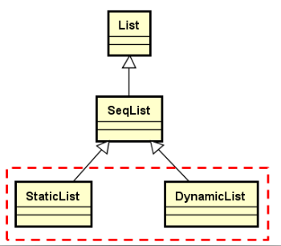

## 1.目标

Seqlist类已经完成了顺序存储结构线性表的抽象实现，实现了插入，删除等关键操作。

但是目前还是**还是不能创建出一个顺序存储结构的线性表**的对象出来，还需要指定实际的**存储空间**是什么，**存储空间的大小**有多大。

这一节的目标：

- 完成StaticList类的具体实现
- 完成DynamicList类的具体实现



StaticList和DynamicList都是SeqList的子类。

是否可以将DynamicList作为StaticList的子类实现？不可以。DynamicList内存结构和StaticList内存结构完全不同，之间没有任何关系，不能作为父子关系，只能作为平级。

## 2.StaticList的实现

### 2.1StaticList设计要点

- StaticList使用**类模板**实现
- 使用**原生数组**作为顺序存储空间
- 使用**模板参数决定数组大小**

```c++
template <typename T, int N>
class StaticList : public SeqList<T>
{
protected:
    T m_space[N];         /* 使用顺序存储空间，N为模板参数 */
public:
    StaticList();         /* 在构造函数中指定父类成员m_array的具体值 */
    int capacity() const; /* 模板参数决定数组大小 */
};
```

### 2.2代码实现

[StaticList.h](../../../QLib/StaticList.h)

测试代码 main.cpp

```c++
#include <iostream>
#include "Exception.h"
#include "StaticList.h"

using namespace std;
using namespace QLib;

int main()
{
    StaticList<int, 5>list;
    for(int i = 0; i < list.capacity(); i++)
    {
        list.insert(0, i);
    }

    for(int i = 0; i < list.length(); i++)
    {
        cout<<list[i]<<endl;//数组的方式访问
    }
    list[0] *= list[0];
    cout<<list[0]<<endl;//数组的方式访问

    try
    {
        list[5] = 0;
    }
    catch(const Exception&e)
    {
        cout<<e.message()<<endl;
        cout<<e.location()<<endl;
    }

    return 0;
}

```

## 3.DynamicList的实现

### 3.1DynamicList设计要点

实现要点

- DynamicList使用类模板实现

- 申请**连续堆空间**作为顺序存储空间

- 支持**动态重置**顺序存储空间的大小

- **保证重置顺序存储空间时的异常安全性**（resize函数）

    

```c++
template <typename T>
class DynamicList : public SeqList<T>
{
protected:
    int m_capacity;           /* 顺序存储空间的大小 */
public:
    DynamicList(int capacity);/* 申请空间 */
    int capacity() const;
    void resize(int capacity);/* 重新设置顺序存储空间的大小 */
    ~DynamicList();           /* 归还空间 */
};
```

### 3.2代码实现

[DynamicList.h](../../../QLib/DynamicList.h)

测试代码：

```c++
#include <iostream>
#include "Exception.h"
#include "DynamicList.h"

using namespace std;
using namespace QLib;

int main()
{
    DynamicList<int>list(5);
    for(int i = 0; i < list.capacity(); i++)
    {
        list.insert(0, i);
    }
    for(int i = 0; i < list.length(); i++)
    {
        cout<<list[i]<<endl;/* 数组的方式访问 */
    }
    cout<<endl;

    try
    {
        list[5] = 0;
    }
    catch(const Exception&e)
    {
        cout<<e.message()<<endl;
        cout<<e.location()<<endl;
        list.resize(10);
        list.insert(5, 50);
    }
    list[5] = 10;
    for(int i=0;i<list.length();i++)
    {
        cout<<list[i]<<endl;
    }
    list.resize(3);
    cout<<endl;
    for(int i=0;i<list.length();i++)
    {
        cout<<list[i]<<endl;
    }

    return 0;
}

```

### 3.3resize()异常安全实现分析

**函数异常安全的概念**

> - 不泄露任何资源
> - 不允许破坏数据

**函数异常安全的基本保证**

> - 如果异常被抛出，对象内的任何成员仍然能保持有效状态
> - 没有数据的破坏和资源泄漏

**resize函数中最后才调用delete的原因**

​		当泛指类型T为类类型时，delete可能会触发析构函数的调用，如果由于某些原因在析构函数中抛出了异常，函数将不会继续向下执行，在异常抛出的地方返回，此时应保证顺序表依然是可用的，将delete放到最后可以防止问题的出现。

**数组成员赋值时发生异常**

```c++
for(int i=0;i<length;i++)
{
    array[i]=this->m_array[i];
}
```

​	DynamicList中存放了T类型的元素，由于T类型对象的复制操作符可能是被重载的，如果重载的赋值操作符函数中发生了异常，这个异常属于类型使用DynamicList的第三方代码导致，这里不做过多考虑。

