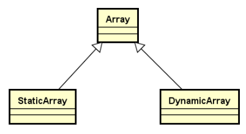

## 1.需求和目标

**需求**

创建数组类**代替原生数组**的使用

- 数组类包含**长度信息**
- 数组类能够**主动发现**越界访问

**目标**

- 完成`Array`类的具体实现 
    - Array类是一个抽象类，用于被继承
- 完成`StaticArray`和`DynamicArray`的具体实现



## 2.Array设计要点

- 使用类模板实现，**存储空间的位置和大小由子类完成**
- **重载数组操作符**，判断访问下标是否合法，不合法抛异常
- 提供数组长度的**抽象访问函数**
- **提供数组对象间的复制操作**

## 3.Array类的声明和实现

### 3.1Array类的声明

```c++
template <typename T>
class Array : public Object
{
protected:
    T * m_array;
public:
    virtual bool set(int i, const T & e);
    virtual bool get(int i, T & e) const;

    T & operator[](int i);
    const T & operator[](int i) const;

    virtual int length() const = 0;
};
```

### 3.2Array类的实现

[Array.h](../../QLib/Array.h)

## 4.StaticArray设计要点

使用类模板实现

- 封装**原生数组**
- **使用模板参数决定数组大小**
- 实现**数组长度**的纯虚函数
- **实现拷贝构造**和**赋值操作**

## 5.StaticArray的声明和实现

### 5.1StaticArray的声明

```c++
template <typename T, int N>
class StaticArray : public Array<T>
{
protected:
    T m_space[N];
public:
    StaticArray();
    StaticArray(const StaticArray<T, N> & obj);
    StaticArray<T, N> & operator = (const StaticArray<T, N> & obj);
    int length() const;
};
```

### 5.2StaticArray的实现

[StaticArray.h](../../QLib/StaticArray.h)

测试程序

```c++
#include <iostream>
#include "StaticArray.h"

using namespace std;
using namespace QLib;
int main()
{
    StaticArray<int ,5> s1;
    for(int i = 0; i<s1.length(); i++)
    {
        s1[i] = i*i;
    }
    
    for(int i = 0;i<s1.length();i++)
    {
        cout<<s1[i]<<endl;
    }

    StaticArray<int ,5> s2;
    s2 = s1;
     
    for(int i = 0; i<s2.length(); i++)
    {
        cout<<s2[i]<<endl;
    }

    s2[6] = 100;//抛出异常

    return 0;
}
```

## 6.DynamicArray设计要点

在创建StaticArray时，数组的大小必须是明确指定的，而DynamicArray的大小可以动态指定。DynamicArray通过**动态申请堆空间**，使得数组长度动态可变

- 使用类模板实现


-   **动态确定**内部数组空间的大小

-   实现函数返回数组长度

-   实现**拷贝构造**和**赋值操作**

## 7.DynamicArray的声明与实现

### 7.1DynamicArray类的声明

**重复代码逻辑的抽象：**

-   init： 对象构造时初始化操作
-   copy：在堆空间中申请新的内存，并执行拷贝操作
-   update：将指定的堆空间作为内部存储数组使用

```c++
template <typename T>
class DynamicArray : public Array<T>
{
protected:
    int m_length;
protected:
    T * copy(T * array, int len, int newLen);
    void update(T * array, int length);
    void init(T * array, int length);
public:
    DynamicArray(int length);
    DynamicArray(const DynamicArray<T> & obj);
    DynamicArray<T>& operator = (const DynamicArray<T> & obj);
    int length() const;
    void resize(int length);
    ~DynamicArray();
};
```

### 7.2DynamicArray类的实现

[DynamicArray.h](../../QLib/DynamicArray.h)

测试main.cpp

```c++
#include <iostream>
#include "DynamicArray.h"

using namespace std;
using namespace QLib;

int main()
{
    DynamicArray<int> s1(5);
    for(int i = 0; i < s1.length(); i++)
    {
        s1[i] = i*i;
    }
    
    for(int i = 0; i < s1.length(); i++)
    {
        cout<<s1[i]<<endl;
    }

    DynamicArray<int> s2(5);
    s2 = s1;
     
    s2.resize(3);
    for(int i = 0; i<s2.length(); i++)
    {
        cout<<s2[i]<<endl;
    }

    s2[6] = 100;//抛出异常
    
    return 0;
}
```

