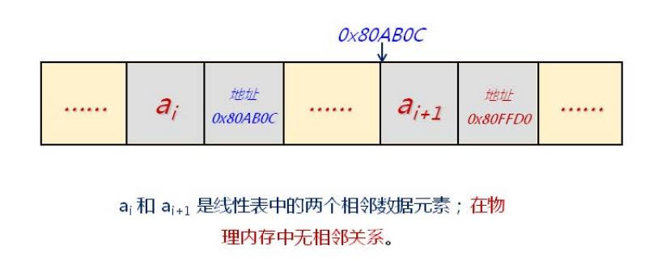
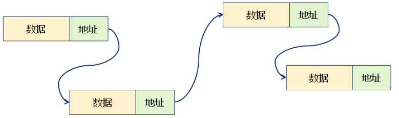
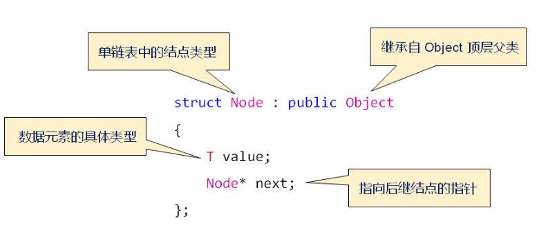
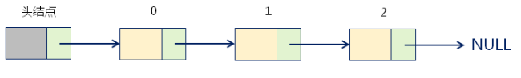
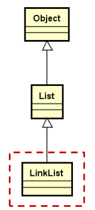
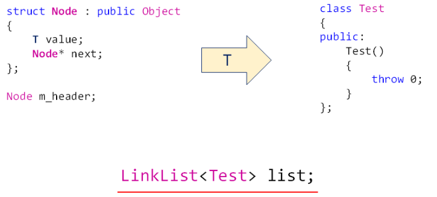
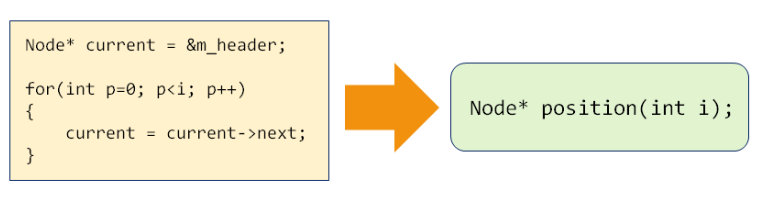

## 1.链表的基本概念

### 1.1 链式存储的定义

为了表示**每个数据元素与其直接后继元素之间的逻辑关系**，数据元素除了存储本身的信息外，还需要存储其直接后继的信息。

链表中的数据元素**在物理内存中无相邻关系**




### 1.2 链式存储的逻辑结构

基于链式存储结构的线性表中，每个结点都包含**数据域**和**指针域**。

-   数据域：存储数据元素本身
-   指针域：存储相邻结点的地址



### 1.3 专业术语的统一

顺序表：

>   基于**顺序存储结构**的线性表

链表：

>基于**链式存储结构**的线性表
>
>1） 单链表： 每个结点只包含直接后继的地址信息
>
>2） 循环链表： 单链表中的最后一个结点的直接后继为第一个结点
>
>3） 双向链表：单链表中的结点包含直接前驱和后继的地址信息

### 1.4 链表中的基本概念

-   头结点：链表中的**辅助结点**，包含指向第一个数据元素的指针
-   数据结点：链表中代表**数据元素的结点**，表现形式为：（数据元素， 地址）
-   尾结点： 链表中的**最后一个数据结点**，包含的地址信息为空

### 1.5 单链表中的节点定义

**定义一个类来表示单链表中的节点**



### 1.6 单链表中内部结构



头结点在单链表中的意义： **辅助数据元素的定位，方便插入和删除操作**。因此，**头结点不存储实际的数据元素**。

### 1.7 单链表的插入操作

1.  从**头结点**开始，通过current指针**定位到目标位置**

2.  从堆空间申请新的Node结点
3.  执行操作：

```c++
node->value = e;
node->next = current->next;
current->next = node;
```

### 1.8 单链表的删除操作

1.  从**头结点**开始，通过current指针**定位到目标位置**

2.  使用toDel指针指向需要删除的结点

3.  执行操作


```c++
toDel = current->next;
current->next = toDel->next;
delete toDel;
```

## 2.完成**链式存储结构**线性表的实现




### 2.1 LinkList设计要点

- 使用模板类实现，**通过头结点访问后继结点**
- 定义内部结点类型Node，用于描述节点的**数据域**和**指针域**
- 实现线性表的**关键操作**（增、删、查、等）

### 2.2 LinkList的声明和实现

#### 2.2.1 LinkList的声明

```c++
template <typename T>
class LinkList : public List<T>
{
protected:
    struct Node : public Object
    {
        T value;
        Note * next;
    };

    Node m_header;/* 头结点 */
    int m_length; /* 记录线性表的长度 */
public:
    LinkList();
};
```

#### 2.2.2 LinkList的初步实现

```c++
#ifndef LINKLIST_H
#define LINKLIST_H

#include "List.h"
#include "Exception.h"

namespace QLib
{

template<typename T>
class LinkList : public List<T>
{
protected:
    struct Node : public Object
    {
        T value;
        Node * next;
    };

    mutable Node m_header;/* 使用mutable修饰，解决const函数中的编译报错问题 */
    int m_length;
public:
    LinkList()
    {
        m_header.next = nullptr;
        m_length = 0;
    }

    bool insert(int i, const T & e)
    {
        bool ret=((0<=i)&&(i<=m_length));
        if(ret)
        {
            Node * node =new Node();
            if(node != nullptr)
            {
                Node *current = &m_header;
                for(int p = 0; p < i; p++)
                {
                    current = current->next;
                }
                node->value = e;
                node->next = current->next;
                current->next = node;

                m_length++;
            }
            else
            {
                THROW_EXCEPTION(NoEnoughMemoryException, "No memory to insert new element...");
            }
        }
        return ret;
    }

    bool insert(const T&e)
    {
        return insert(m_length, e);
    }

    bool remove(int i)
    {
        bool ret = ((0 <= i) && (i < m_length));
        if(ret)
        {
            Node * current = &m_header;
            for(int p = 0; p < i; p++)
            {
                current = current->next;
            }

            Node *toDel = current->next;
            current->next = toDel->next;
            delete toDel;
            m_length--;
        }
        return ret;
    }

    bool set(int i, const T & e)
    {
        bool ret = ((0 <= i) && (i < m_length));
        if(ret)
        {
            Node * current = &m_header;
            for(int p = 0; p < i; p++)
            {
                current = current->next;
            }
            current->next->value = e;
        }
        return ret;
    }

    /**
     * 由于当前定义的get函数是一个const成员函数，我们不能在这个函数中修改任何成员变量的值，
     * 然而Node *current=&m_header;会让编译器认为有可能修改到变量的值，所以会编译报错。
     * 所以 ，mutable修饰 m_header即可。
     */
    bool get(int i, T & e)const
    {
        bool ret = ((0 <= i) && (i < m_length));
        if(ret)
        {
            Node * current = &m_header;
            for(int p = 0;p < i; p++)
            {
                current = current->next;
            }
            e = current->next->value;
        }
        return ret;
    }

    T get(int i) const
    {
        T ret;
        if(get(i, ret))
        {
            return ret;
        }
        else 
        {
            THROW_EXCEPTION(IndexOutOfBoundsException,"Invalid parameter i to get element...");
        }
    }

    int length() const
    {
        return m_length;
    }

    void clear()
    {
        while(m_header.next)
        {
            Node* toDel = m_header.next;
            m_header.next = toDel->next;
            delete toDel;
        }
        m_length = 0;
    }

    ~LinkList()
    {
        clear();
    }
};

}

#endif

```

测试代码

```c++
#include <iostream>
#include "LinkList.h"

using namespace std;
using namespace QLib;

int main()
{

    LinkList<int > list;

    for(int i = 0; i < 5; i++)
    {
        list.insert(0, i);
        list.set(0, i*i);
    }
/*
    for(int i = 0; i< list.length(); i++)
    {
        int v = 0;
        list.get(i, v);//此get函数使用起来不方便，因此添加一个重载版本： T get(int i) const 
        cout<<v<<endl;
    }
*/    
    for(int i = 0; i < list.length(); i++)
    {
        cout<<list.get(i)<<endl;
    }
    
    list.remove(2);
    
    for(int i = 0; i < list.length(); i++)
    {
        cout<<list.get(i)<<endl;
    }
    
    list.clear();
    
    for(int i = 0; i<list.length(); i++)
    {
        cout<<list.get(i)<<endl;
    }

    return 0;
}

```

### 2.3 代码优化

#### 2.3.1 头结点是否存在隐患？实现代码是否需要优化？

**头结点存在的隐患：**

创建头结点时，将会调用成员变量 value的构造函数，如果T类型的value在构造函数中会抛出异常，会导致头结点创建会出错。因此需要重新定义一个结构体来实现头结点。



测试代码：

```c++
#include <iostream>
#include "LinkList.h"

using namespace std;
using namespace QLib;

class Test
{
public:
    Test()
    {
        throw 0;
    }
};

int main()
{
	LinkList<Test > list;
	
	cout<<"create list ok"<<endl;
    Test t;
    list.insert(t);
	return 0;
}
```

代码中看起来没有定义任何Test类型的对象，我们创建的是单链表对象`LinkList<Test> list`,但是程序却抛出了异常，这可能导致我们怀疑LinkList的自身实现有问题，而问题的根本原因是：

>创建`LinkList<Test> list`时，会构造头结点对象，头结点对象中会构造 T类型的value，value是一个有问题的对象，在构造函数中抛出异常，导致程序异常终止。

因此，我们应该想办法在构造头结点的时候，不去调用泛指类型的构造函数。


解决方案：

Node节点中，我们只使用Noe* next， T类型的value根本没有使用，因此我们在头结点中使用一个内存布局与value相同的数组来替代value。

```c++
mutable struct : public Object
{
    char reserved[sizeof(T)];
    Node* next;
} m_header;      // 优化头结点，防止类型异常发生

```

这样实现的头结点m_header在内存布局上面和之前没有任何差异，而且**不会调用构造函数**了。

优化后再次测试代码,异常就不会在创建list的时候抛出了，而是在用户创建T类型的对象时才会抛出异常，这样更易于帮助我们定位问题。

注意：

- [x] 新的m_header实现也要继承自Object，否则将造成和Node类型内存布局上的不同。

#### 2.3.2 元素定位优化

insert，remove，get，set等操作都涉及元素定位，因此我们可以抽象一个position函数。



```c++
Node* position(int i) const
{
    Node* ret = reinterpret_cast<Node*>(&m_header);

    for(int p = 0; p < i; p++)
    {
        ret = ret->next;
    }

    return ret;
}
```

### 2.4 最终代码

[LinkList.h](../../../QLib/LinkList.h)

### 2.5 总结

- 通过类模板实现链表，包含**头结点**和**长度成员**，头结点没有什么功能，仅仅启一个辅助的作用，有了头结点之后，插入、删除等操作变的简单了
- **定义结点类型**， 并通过堆中的结点对象构成链表存储
- 为避免构造错误的隐患，**头结点类型需要重定义**
- 代码优化是编码完成后必不可少的环节
