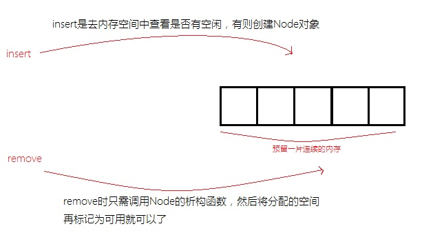
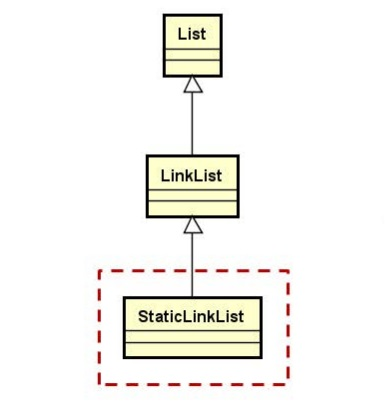

## 1.问题提出

单链表的缺陷分析

> 长时间使用单链表对象频繁增加和删除数据元素，堆空间可能产生大量的内存碎片，导致系统运行缓慢

- 如果需要频繁增删数据元素，怎么选择线性表？
- 如果数据元素最大个数是固定的，除了单链表有没有更好的选择？

## 2.新的线性表

### 2.1设计思路

使用顺序表的设计方法加上单链表的设计方法得到静态单链表的设计思路

> 在“单链表”的内部增加一片预留的空间，所有的Node对象都在这片空间中动态创建和动态销毁。


### 2.2静态单链表内存使用分析




除了内存分配的不同之外，静态单链表和之前实现的单链表操作完全相同，只需要重新实现create和destroy就可以了。

因此在类的继承层次结构上，静态链表应该是单链表的子类。



### 2.3静态单链表的实现思路

- 通过模板定义静态单链表（`StaticLinkList`）
- 在类中定义固定大小的空间（`unsigned cha[]`）
- 重写create和destroy函数，**改变内存的分配和归还方式**
- 在Node类中重载`operator new`，用于在指定内存上创建对象

## 3.代码实现

```c++
#ifndef STATICLINKLIST_H
#define STATICLINKLIST_H

#include "LinkList.h"

namespace QLib
{

template <typename T, int N>/* N用来定义预留空间大小使用 */
class StaticLinkList : public LinkList<T>
{
protected:
    typedef typename LinkList<T>::Node Node; /* 重命名 */
    struct SNode : public Node
    {
        /* void* loc 是调用构造函数的内存地址*/
        void * operator new(unsigned long int size, void * loc)
        {
            (void)size;
            return loc;
        }
    };
    unsigned char m_space[sizeof(SNode) * N];/* 预留空间大小 */
    int m_used[N];                           /* 标记数组 */
protected:
    Node * create();                         /* 重写create() */
    void destroy(Node * pn);                 /*重写destroy() */
public:
    StaticLinkList();
    ~StaticLinkList();
    int capacity();
};

template <typename T, int N>
typename LinkList<T>::Node * StaticLinkList<T, N>::create() /* 重写create函数 */
{
    SNode * ret = nullptr;

    for(int i = 0; i < N; i++)
    {
        if(!m_used[i])
        {
            ret = reinterpret_cast<SNode*>(m_space) + i;
            ret = new(ret)SNode();/* 括号内的地址用于指定想在那一块内存空间中调用构造函数 */
            m_used[i] = 1;
            break;
        }
    }

    return ret;
}

template <typename T, int N>
void StaticLinkList<T, N>::destroy(Node * pn)/* 重写destroy() */
{
    SNode * space = reinterpret_cast<SNode *>(m_space);
    SNode * psn = dynamic_cast<SNode *>(pn);

    for(int i = 0; i < N; i++)
    {
        if(psn == (space + i))
        {
            m_used[i] = 0;
            psn->~SNode();/* 通过对象指针主动调用对象析构函数*/
            break;        /* 空间归还即可调出循环 */
        }
    }
}

template <typename T, int N>
StaticLinkList<T, N>::StaticLinkList()
{
    for(int i = 0; i < N; i++)
    {
        m_used[i] = 0;
    }
}

template <typename T, int N>
int StaticLinkList<T, N>::capacity()
{
    return N;
}

template <typename T, int N>
StaticLinkList<T, N>::~StaticLinkList()
{
    this->clear();
}

}

#endif
```

分析：

LinkList中封装create和destroy函数的意义是什么？

>为静态单链表(StaticLinkList)的实现做准备。
>
>StaticLinkList与LinkList的不同仅仅在于链表节点内存分配上的不同。因此，**将仅有的不同封装于父类和子类的虚函数中**。

## 4.总结

**顺序表与单链表相结合**后衍生出静态单链表

静态单链表是LinkList的子类，**拥有单链表的所有操作**

静态单链表**在预留的空间中创建节点对象**

静态单链表适合于频繁增删数据元素的场合（**最大元素个数固定**）