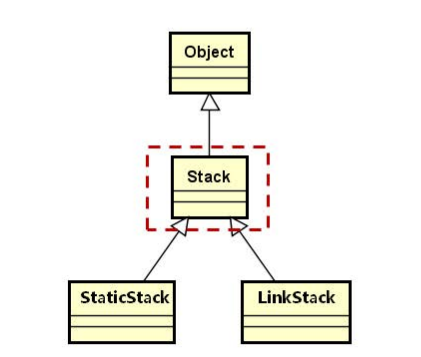

## 1.栈的定义

- 栈是一种**特殊的线性表**

- 栈仅能在线性表的一端进行操作

    - 栈顶（Top）：允许操作的一端
    - 栈底（Bottom）：不允许操作的一端

## 2.栈的特性

**后进先出**（Last In First Out）


## 3.栈的操作

- 创建栈`Stack()`

- 销毁栈`~Stack()`

- 清空栈`clear()`

- 进栈`push()`

- 出栈`pop()`

- 获取栈顶元素`top()`

- 获取栈的大小`size()`

## 4.栈的实现

Stack是一个抽象父类，直接继承自顶层父类Object



```c++
template <typename T>
class Stack : public Object
{
public:
    virtual void push(const T & e) = 0;
    virtual void pop() = 0;
    virtual T top() const = 0;
    virtual void clear() = 0;
    virtual int size() const = 0;
};
```

## 5.顺序栈的实现

StaticStack是栈的具体实现，当栈空时top指向-1， 当栈满时，top指向capacity-1


**StaticStack设计要点**

- 使用类模板实现
- 使用**原生数组**作为栈的存储空间
- 使用模板参数决定栈的**最大容量**

```c++
template <typename T, int N>
class StaticStack : public Stack<T>
{
protected:
    T m_space[N]; /* 栈存储空间，N为模板参数 */
    int m_top;    /* 栈顶标识 */
    int m_size;   /* 当前栈的大小 */
public：
    StaticStack();/* 初始化成员变量 */
    int capacity() const;
    //...
};
```

**编程实现**

- 创建栈`Stack()`

    创建栈时，栈为空，top指向-1,栈的大小为0

    ```c++
    StaticStack<T, N>::StaticStack()
    {
        m_top = -1;
        m_size = 0;
    }
    ```

    

- 销毁栈`~Stack()`

    销毁栈无释放内存等操作，可直接使用编译器生成的默认析构函数。

    

- 清空栈`clear()`

    ```c++
    template <typename T, int N>
    void StaticStack<T, N>::clear()
    {
        m_top = -1;
        m_size = 0;
    }
    ```

    

- 进栈`push()`

    栈不满则进栈，否则抛出异常。注意先入栈成功后才将栈的top和size加1，因为入栈过程中调用元素的赋值操作符函数可能发生异常，发生异常时仍然需要保证栈的正确性。

    ```c++
    void StaticStack<T, N>::push(const T & e)
    {
        if(m_size < N)
        {
            m_space[m_top + 1] = e; //可能会抛出异常
            m_top++;
            m_size++;
        }
        else
        {
            THROW_EXCEPTION(InvalidOperationException, "No space in current stack ...");
        }
    }
    ```

    

- 出栈`pop()`

    ​    栈不会空则 top和size减1，否则抛出异常

    ```c++
    void StaticStack<T, N>::pop()
    {
        if(m_size > 0)
        {
            m_top--;
            m_size--;
        }
        else 
        {
            THROW_EXCEPTION(InvalidOperationException, "No element in current stack...");
        }
    }
    ```

    

- 获取栈顶元素`top()`

    ```c++
    T StaticStack<T, N>::top() const
    {
        if(m_size > 0)
        {
            return m_space[m_top];
        }
        else
        {
            THROW_EXCEPTION(InvalidOperationException, "No element in current stack...");
        }
    }
    ```

    

- 获取栈的大小`size()`

```c++
int StaticStack<T, N>::size() const
{
    return m_size;
}
```


## 6.总结

- 栈是一种特殊的线性表
- **栈只允许在线性表的一端进行操作**
- StaticStack使用**原生数组**作为内部存储空间
- StaticStack的最大容量有模板参数决定