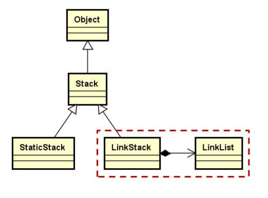

## 1.StaticStack的缺陷

当存储的元素的类型为类类型时，StaticStack的对象在创建时，即使还没有入栈操作，也会多次调用元素的构造函数，原因是StaticStack内部是使用数组实现的。

```c++
class StaticStack : public Stack<T>
{
    //...
    T m_space[N]; /* 栈存储空间，N为模板参数 */
    //...
}
```

## 2.链式栈的存储实现

- 使用类模板实现，它是抽象父类Stack的直接子类
- 在内部组合使用LinkList类，实现栈的链式存储
- 只在单链表成员对象的头部进行操作



## 4.编程实现

- 进栈`push()`

    使用头插法，将元素插入到内部链表的头部

    ```c++
    void push(const T & e)
    {
        m_list.insert(0, e);
    }
    ```

    

- 出栈`pop()`

    栈里有数据元素，则出栈链表的第一个元素，否则抛出异常。

    ```c++
    void pop()
    {
        if(m_list.length() > 0)
        {
            m_list.remove(0);
        }
        else
        {
            THROW_EXCEPTION(InvalidOperationException, "No element in current stack...");
        }
    }
    ```
    

    
- 获取栈顶元素`top()`

    返回链表中下标为0的元素的值

    ```c++
    T top() const
    {
        if(m_list.length() > 0)
        {
            return m_list.get(0);
        }
        else
        {
            THROW_EXCEPTION(InvalidOperationException, "No element in current stack...");
        }
    }
    ```

    

- 获取栈的大小`size()`

    ```c++
    int LinkStack<T>::size() const
    {
        return m_list.length();
    }
    ```

    

- 清空栈`clear()`

    ```c++
    void clear()
    {
        m_list.clear();
    }
    ```

