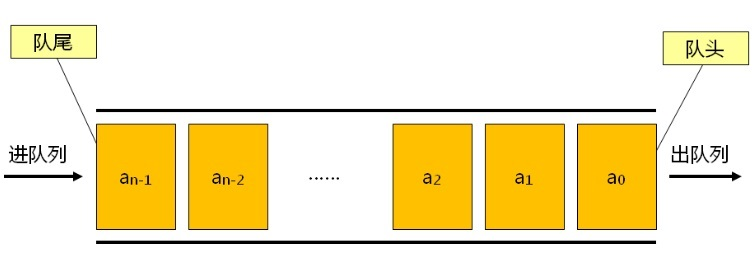
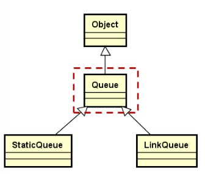
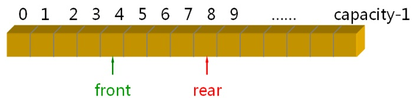

## **0. 队列的定义**

- 队列是一种特殊的线性表

- 队列**仅能在线性表的两端**进行操作

    **队头**（Front）：取出数据元素的一端

    **队尾**（Rear）：插入数据元素的一端

## **1. 队列的特性**

**先进先出**（First In First Out）



## **2. 队列的操作**

- 创建队列(`Queue()`)
- 销毁队列(`~Queue()`)
- 清空队列(`clear()`)
- 进队列(`add()`)
- 出队列(`remove()`)
- 获取队头元素(`front()`)
- 获取队列的长度(`length()`)

## 3.队列的抽象实现



```c++
template < typename T >
class Queue : public Object
{
public:
    virtual void add(const T& e) = 0;
    virtual void remove() = 0;
    virtual T front() const = 0;
    virtual void clear() = 0;
    virtual int length() const = 0;
};
```

## **4. 队列的顺序实现**



### **StaticQueue**设计要点：

- 使用类模板实现
- 使用**原生数组**作为队列的存储空间
- 使用模板参数决定队列的**最大容量**

```c++
template <typename T, int N>
class StaticQueue : public Queue<T>
{
protected:
    T m_space[N];    // 队列存储空间，N为模板参数
    int m_front;     // 队头标识
    int m_rear;      // 队尾标识
    int m_length;    // 当前队列的长度
public:
    StaticQueue();   // 初始化成员变量
    int capacity() const;
};
```

### **StaticQueue实现要点：（循环计数法）**

- 关键操作：

进队列：

```c++
m_space[m_rear] = e;
m_rear = (m_rear + 1) % N;
```

出队列：

```c++
m_front = (m_front + 1) % N;
```

- 队列的状态： 

队空：

```c++
(m_length == 0) && (m_front == m_rear)
```

队满：

```c++
(m_length == N) && (m_front == m_rear)
```

## 5.编程实现基于顺序存储结构的队列

- 创建队列(`Queue()`)

    ```c++
    StaticQueue()
    {
        m_rear = 0;
        m_front = 0;
        m_length = 0;
    }
    ```

    

- 清空队列(`clear()`)

    ```c++
    clear()
    {
        m_rear = 0;
        m_front = 0;
        m_length = 0;
    }
    ```

    

- 进队列(`add()`)

    ```c++
    void add(const T & e)
    {
        if(m_length < N)
        {
            m_space[m_rear] = e;
            m_rear = (m_rear + 1) % N;
            m_length++;
        }
        else
        {
            THROW_EXCEPTION(InvalidParameterException, "Not space add queue...");
        }
    }
    ```

    

- 出队列(`remove()`)

    ```c++
    void remove()
    {
        if(m_length > 0)
        {
            m_front = (m_front + 1) % N;
            m_length--;
        }
        else
        {
            THROW_EXCEPTION(InvalidParameterException, "No element in current queue...");
        }
    }
    ```

    

- 获取队头元素(`front()`)

    ```c++
    T front() const
    {
        if(m_length > 0)
        {
            return m_space[m_front];
        }
        else
        {
            THROW_EXCEPTION(InvalidOperationException, "No elemtnet int current queue...");
        }
    }
    ```

    

- 获取队列的长度(`length()`)

```c++
int length() const
{
    return m_length;
}
```

## 6.总结

- 队列是一种**特殊的线性表**，具有**先进先出的特征**
- 队列只允许在线性表的两端进行操作，一端进，一端出
- StaticQueue使用**原生数组**作为内部存储空间
- StaticQueue的**最大容量由模板参数决定**
- StaticQueue采用**循环计数法**提高队列操作的效率