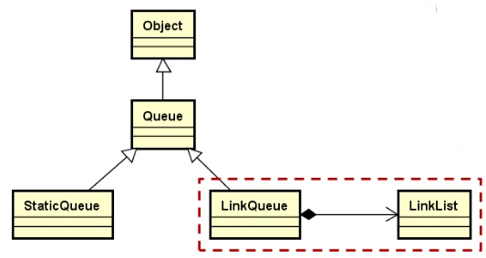
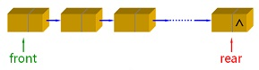
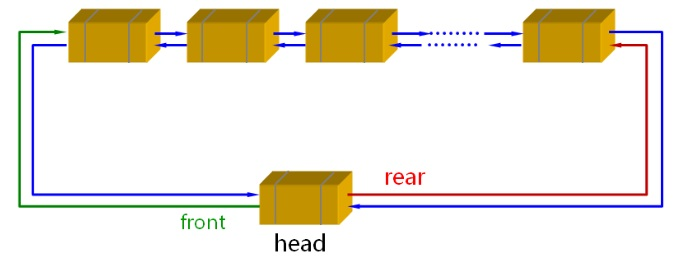
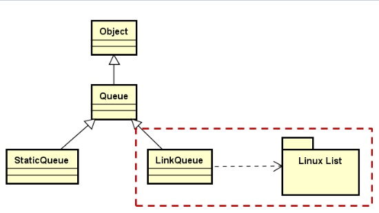

## 1. 链式队列的初步实现

- 使用类模板实现，它是抽象父类Queue的直接子类
- 在内部**使用链式结构**实现元素的存储
- 只在链表的**头部**和**尾部**进行操作




**内部组合使用单链表：**

front指向队列头部，出队是front指向的元素出队，rear指向队列最后一个数据元素。



LinkQueue.h

```c++
#ifndef LINKQUEUE_H
#define LINKQUEUE_H

#include "Queue.h"
#include "LinkList.h"
#include "Exception.h"

namespace QLib
{

template <typename T>
class LinkQueue : public Queue<T>
{
protected:
    LinkList<T> m_list;
public:
    LinkQueue();
    void add(const T & e);
    void remove();
    T front() const;
    void clear();
    int length() const;
};

template <typename T>
LinkQueue<T>::LinkQueue()
{
}

template <typename T>
void LinkQueue<T>::add(const T & e)//O(n)
{
    m_list.insert(e);
}

template <typename T>
void LinkQueue<T>::remove()//O(1)
{
    if(m_list.length() > 0)
    {
        m_list.remove(0);
    }
    else
    {
        THROW_EXCEPTION(InvalidOperationException, "No element in current link queue...");
    }
}

template <typename T>
T LinkQueue<T>::front()const//O(1)
{
    if(m_list.length()>0)
    {
        return m_list.get(0);
    }
    else
    {
        THROW_EXCEPTION(InvalidOperationException, "No element in current link queue...");
    }
}

template <typename T>
void LinkQueue<T>::clear()//O(n)
{
    m_list.clear();
}

template <typename T>
int LinkQueue<T>::length() const//O(1)
{
    return m_list.length();
}

}
#endif
```

编写测试：

```c++
#include <iostream>
#include "LinkQueue.h"

using namespace std;
using namespace QLib;

int main(int argc, const char *argv[])
{
    LinkQueue<int >queue;

    for(int i = 0; i < 5; i++)
    {
        queue.add(i);
    }

    while(queue.length())
    {
        cout<<queue.front()<<endl;
        queue.remove();
    }

    return 0;
}
```

## 2.使用`LinkList`类实现链式队列是否合适？是否有更好的方案？

**分析：**

- [x] 使用`LinkList`类实现链式队列时，**插入操作**的时间复杂度为**O(n)**，大大影响了链式队列的性能。


## 3.队列链式存储实现的优化

将`LinkQueue`依赖于`LinuxList`双向循环链表，可以通过头结点head以O(1)的时间复杂度访问对头、对尾部元素。



在LinkQueue内部组合使用LinuxList实现链式队列，新的继承关系图如下：



## 4.基于Linux内核链表的队列

LinkQueue包含一个list_head类型的成员，并且在队列结点元素Node的头部增加list_head成员。

```c++
class LinkQueue : public Queue<T>
{
protected:
    struct Node : public Object
    {
        list_head head;
        T value;
    };
    list_head m_header;
    int m_length;
public:
    //...
};
```

创建队列，在队列的构造函数中初始化m_header，并将队列长度置为0。

```c++
template <typename T>
LinkQueue<T>::LinkQueue()
{
    INIT_LIST_HEAD(&m_header);
    m_length = 0;
}
```

进队列函数内部使用list_add_tail实现，由于list_add_tail的时间复杂度为O(1)，所以add的时间复杂度也为O(1)。
```c++
template <typename T>
void LinkQueue<T>::add(const T & e)
{
    Node *node = new Node();
    if(node != nullptr)
    {
        node->value = e;
        list_add_tail(&(node->head), &m_header);
        m_length++;
    }
    else
    {
        THROW_EXCEPTION(NoEnoughMemoryException, "No memory to add element in LinkQueue...");
    }
}
```

出队列内部使用list_del实现。

```c++
template <typename T>
void LinkQueue<T>::remove()
{
    if(m_length > 0)
    {
        list_head * toDel = m_header.next;
        list_del(toDel);
        m_length--;
        delete list_entry(toDel, Node, head);
    }
    else
    {
        THROW_EXCEPTION(InvalidOperationException, "No element in current link queue...");
    }
}
```

## 5.总结

- `StaticQueue`在初始化时**可能多次调用**元素类型的构造函数
- `LinkList`的组合使用**能够实现队列的功能**，但**效率不高**
- `LinkQueue`的最终实现**组合使用**了**Linux内核链表**
- `LinkQueue`中入队和出队操作可以在**常量时间完成**